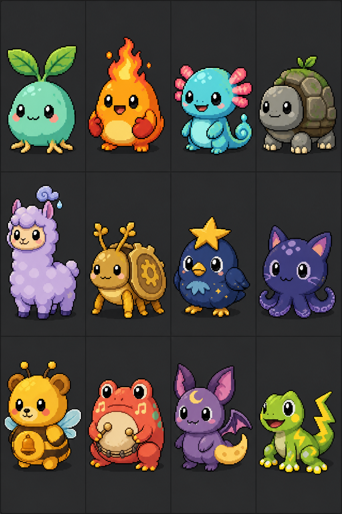

# Tamagezi 电子宠物玩法与形象设计

状态：玩法基线 v1.0。`demo/tamagezi` 已实现完整的单机核心循环；本文后半部分仍保留可继续扩展的美术、动画与联网方向。

Tamagezi 是为 FoloToy AI Passport 设计的原创电子宠物。它借鉴经典掌上电子宠物的“照料—反馈—成长—传承”循环，但不复制 Tamagotchi 的角色、图标、文案或界面。



## 1. 设计目标

- 三秒能看懂宠物当前最需要什么，三次按键内完成一次日常照料。
- 让喂食、如厕、清洁、治疗形成情感责任，而不是重复点菜单。
- 用工作、锻炼、教育形成长期养成，并以金币提供清晰的正向反馈。
- 12 只基础宠物都可直接选择，不用抽卡，不设置付费或随机稀有度。
- 合体继承外观、性格与能力，让每一代宠物留下痕迹。
- 适配三键、240 × 320 竖屏、8 MB Flash 和无 PSRAM 的硬件条件。
- 断电时冻结宠物状态，不因设备关机造成无法挽回的照料失败。

## 2. 从经典拓麻歌子提炼的原则

官方 Original Tamagotchi 把喂食、排泄清理、治疗、管教和小游戏组成基础照料循环，并让养育方式影响成年形态；Tamagotchi Connection 又加入训练、货币、物品和代际连接；Tamagotchi Uni 使用食物偏好、个性、散步、小游戏赚取点数和商店消费扩展日常；Tamagotchi Paradise 进一步使用环境、物种和基因传承产生差异。

Tamagezi 只借鉴这些抽象原则：

| 借鉴原则 | Tamagezi 的原创实现 |
| --- | --- |
| 需求会随时间变化 | 饱腹、心情、清洁、健康、精力五项状态 |
| 照料方式决定成长 | 知识、体能、教养、亲密四项成长倾向 |
| 小游戏提供货币 | 工作、锻炼和教育小游戏获得金币 |
| 宠物有个性与喜好 | 每只宠物有偏好、讨厌项、职业倾向和声音动机 |
| 繁育让下一代不同 | 合体继承主形体、次要特征、性格与一项天赋 |
| 疏忽需要后果 | 生病、拒绝工作、情绪低落和成长偏移，但不突然清档 |

参考资料：

- [Original Tamagotchi 官方产品说明](https://tamagotchi-official.com/us/series/original/item/01_528/)
- [Original Tamagotchi 官方说明书](https://tamagotchi-official.com/manual/toy/original/Original_webmanual.pdf)
- [Tamagotchi Connection 官方说明书](https://tamagotchi-official.com/manual/toy/connection/connection_web_manual_IS_PT.pdf)
- [Tamagotchi Uni 官方玩法介绍](https://tamagotchi-official.com/us/series/uni/howtoplay/)
- [Tamagotchi Paradise 官方产品说明](https://tamagotchi-official.com/us/series/paradise/item/01_1000/)

## 3. 核心体验

```text
宠物发出需求
  → 玩家判断需求
  → 喂食 / 如厕 / 清洁 / 治疗 / 陪伴
  → 宠物用动作和声音反馈
  → 状态稳定后参加工作 / 锻炼 / 教育
  → 获得金币、能力和亲密度
  → 成长、解锁职业、毕业或合体
  → 下一代继承特征
```

一次轻量照料约 5～15 秒，一次小游戏约 20～40 秒。玩家每天打开数次即可正常成长，不要求持续在线。

### 3.1 可见状态

| 状态 | 表现 | 主要恢复方式 |
| --- | --- | --- |
| `FULL` 饱腹 | 低时摸肚子、看食盆 | 正餐；零食只少量恢复 |
| `MOOD` 心情 | 低时背对玩家或叹气 | 陪玩、喜欢的食物、休息 |
| `CLEAN` 清洁 | 身体脏、房间出现污物 | 及时如厕、清理房间、洗澡 |
| `HEALTH` 健康 | 打喷嚏、冒病符、行动变慢 | 诊断、药物、休息；先处理病因 |
| `ENERGY` 精力 | 打哈欠、动作变慢 | 睡眠和休息 |

首页不用同时显示五条数字进度条。默认只显示表情、环境和最多两个需求图标；完整数值放在 `STATUS` 页面。

### 3.2 隐藏成长倾向

- `KNOWLEDGE`：教育、解谜和阅读积累。
- `FITNESS`：锻炼、健康饮食和规律作息积累。
- `MANNERS`：及时如厕、回应合理呼叫、表扬或纠正积累。
- `BOND`：稳定照料和共同活动积累，不靠反复喂零食刷取。

四项倾向决定成年性格、职业效率、合体遗传和结局徽章，但不会阻止玩家使用任何功能。

## 4. 成长与时间

| 阶段 | 建议持续时间 | 解锁内容 |
| --- | ---: | --- |
| `EGG` 蛋 | 1 分钟 | 选择 12 种宠物之一 |
| `BABY` 幼体 | 30 分钟有效陪伴时间 | 喂食、清洁、治疗、简单陪玩 |
| `CHILD` 儿童 | 4 小时有效陪伴时间 | 教育、基础锻炼、资料页 |
| `TEEN` 少年 | 12 小时有效陪伴时间 | 工作、职业倾向、更多表情 |
| `ADULT` 成年 | 长期 | 高级工作、合体、毕业徽章 |

硬件没有已确认的独立 RTC。第一版以“设备运行时的有效陪伴时间”推进成长，并把快照保存到 NVS；完全断电时状态冻结。以后如果启用 Wi-Fi 校时或确认可靠的硬件时钟，再增加真实昼夜和离线时间流逝。

开发版本必须提供时间倍率和直接设置阶段的调试入口，避免每次测试都真实等待数小时。

## 5. 八项主要功能

### 5.1 `FEED` 喂食

- 免费基础餐保证宠物不会因为没金币而挨饿。
- 正餐主要恢复饱腹，零食主要提升心情，但过量会增加体重和生病概率。
- 每只宠物有一种喜欢和一种讨厌的食物；首次发现会写入资料页。
- 食物进入“消化队列”，在 30～90 分钟有效时间后触发如厕需求。

### 5.2 `TOILET` 如厕与清洁

- 排泄前宠物会有短暂的踱步提示，及时带去厕所可增加 `MANNERS`。
- 错过提示会在房间留下污物并降低 `CLEAN`；清扫恢复环境，但不奖励金币，防止故意制造污物刷奖励。
- 多次未清理会提高生病概率，环境也会逐步变色。
- 洗澡清洁宠物本体，扫除清洁房间，两者是不同状态。

### 5.3 `TREAT` 治疗

- 症状分为感冒、肠胃不适、疲劳和脏污感染四类，用动画和图标表达，不模拟真实医疗建议。
- 玩家先选择症状，再选休息、清洁、基础药或营养餐。
- 基础药免费，避免经济系统造成无法救治；特殊药只缩短恢复时间。
- 错误处理不会立刻失败，只会让恢复变慢并给出更明确的提示。

### 5.4 `TRAIN` 锻炼

三种 20～30 秒小游戏轮换：

- `DASH`：在节拍点按 `OK` 冲刺。
- `JUMP`：用 `UP` / `DOWN` 选择高低障碍，`OK` 起跳。
- `BALANCE`：根据倾斜指示快速选择 `UP` 或 `DOWN`。

锻炼消耗精力，提升 `FITNESS`，控制体重，并给予少量金币。疲劳或生病时宠物会拒绝高强度训练。

### 5.5 `LEARN` 教育

- `PATTERN`：记住 3～6 步方向序列。
- `SORT`：根据颜色或形状选择类别。
- `MANNERS`：面对情境选择表扬、等待或制止。

教育提升 `KNOWLEDGE` 或 `MANNERS`。连续答错时降低难度，不扣金币，也不把“教育”表现为惩罚。

### 5.6 `WORK` 工作

儿童期结束后解锁四种短工作：

| 工作 | 玩法 | 优势属性 | 基础金币 |
| --- | --- | --- | ---: |
| `CAFE` 咖啡店 | 按顺序完成订单 | 教养 | 6～12 |
| `COURIER` 快递 | 左右躲避并准时送达 | 体能 | 6～14 |
| `WORKSHOP` 工坊 | 复现零件组合 | 知识 | 7～15 |
| `CLINIC` 护理站 | 根据症状匹配照料 | 亲密/知识 | 7～15 |

工作消耗精力并设置冷却，不能无限刷币。属性只提供约 10% 优势，任何宠物都能尝试全部工作。

### 5.7 `FUSION` 合体

- 成年且 `BOND ≥ 80` 后，当前宠物可与资料库中的一枚“记忆基因”合体。
- 记忆基因来自以前完成毕业的宠物，不要求第二台设备。
- 新宠物继承四类信息：主形体、一个次要外观特征、性格、一个天赋。
- 视觉上使用“基础身体 + 特征覆盖层 + 调色板”组合，不为每个组合保存完整动画。
- 合体前提供完整预览和二次确认；原宠物进入相册，不直接删除记录。
- 第一版固件可先保留入口和数据结构，实际合体作为第二阶段实现。

12 个基础形体两两组合共有 78 种无序组合；通过颜色和性格继续产生差异，但不承诺为每种差异绘制独立角色。

### 5.8 `PROFILE` 资料

资料页包含：

- 名称、物种、阶段、年龄、体重、性格和世代；
- 饱腹、心情、清洁、健康和精力；
- 知识、体能、教养、亲密；
- 喜欢/讨厌的食物、最擅长的工作；
- 累计金币、照料失误、徽章和家族谱。

## 6. 金币激励机制

货币暂定为 `COIN`，首页只显示整数，不引入付费货币或抽卡。

### 6.1 获得金币

| 行为 | 奖励 | 设计目的 |
| --- | ---: | --- |
| 首次完成教程 | 30 | 保证能立即体验商店 |
| 每个宠物日首次及时如厕 | 2 | 奖励预判，不奖励事后清扫 |
| 完成教育小游戏 | 2～8 | 兼顾学习成长 |
| 完成锻炼小游戏 | 2～8 | 兼顾健康成长 |
| 完成工作 | 6～15 | 主要稳定收入 |
| 成长、毕业和徽章 | 10～50 | 提供长期里程碑 |

每个“宠物日”的普通收入上限为 60，里程碑奖励不计入上限。连续照料奖励使用 1、2、3、5、8 的缓慢阶梯，漏一天只回退一级，不全部清零。

### 6.2 消费金币

- 普通零食：2～5。
- 特别食物：6～12。
- 玩具、书籍和健身器材：8～25。
- 房间装饰：10～40。
- 合体胶囊：30；第一次免费。

基础餐、清洁和基础治疗永远免费。金币用于表达选择和成就，不用于制造生存压力。

## 7. 12 只基础宠物

概念图按从左到右、从上到下的顺序排列。生产 UI 使用英文短名，中文名仅用于设计沟通。

| # | UI 名称 | 中文代称 | 形象关键词 | 性格与偏好 | 轻度天赋 | 声音动机 |
| ---: | --- | --- | --- | --- | --- | --- |
| 1 | `SPRIG` | 芽团 | 薄荷种子、叶耳、根脚 | 耐心，喜欢蔬菜 | 教育/园艺 | 木琴式上行三音 |
| 2 | `EMBER` | 火绒 | 橙色火苗、手套爪、圆肚 | 热情，喜欢热食 | 咖啡店 | 带滑音的暖方波 |
| 3 | `BLOOP` | 泡仔 | 青色蝾螈、泡泡鳃、水滴尾 | 温柔，喜欢洗澡 | 护理站 | 水滴与圆润颤音 |
| 4 | `ROOK` | 岩壳 | 卵石龟、方壳、粗短腿 | 稳重，讨厌催促 | 锻炼/工坊 | 低音木块双击 |
| 5 | `NIMBUS` | 云绒 | 淡紫云羊驼、雨卷毛 | 慢热，喜欢音乐 | 心情恢复 | 柔和五度和声 |
| 6 | `COGGO` | 齿甲 | 金色甲虫、齿轮翅壳 | 专注，喜欢零件 | 工坊 | 齿轮咔嗒加短琶音 |
| 7 | `NOVA` | 星啾 | 深蓝小鸟、星形冠 | 好奇，喜欢读书 | 教育 | 明亮高音星闪 |
| 8 | `INKY` | 墨爪 | 墨色猫头、四条短触足 | 害羞，喜欢绘画 | 记忆小游戏 | 低音泡泡与软喵音 |
| 9 | `HONEY` | 蜜铃 | 蜂熊、透明小翅、铃铛纹 | 外向，喜欢甜食 | 工作金币 +5% | 铃声三连击 |
| 10 | `TEMPO` | 鼓蛙 | 珊瑚红鼓肚蛙、音符脸 | 爱表演，讨厌安静太久 | 节奏锻炼 | 切分鼓点 |
| 11 | `LUNA` | 月翼 | 梅紫蝠耳、月牙尾 | 夜猫子，喜欢安静 | 精力恢复 | 低音三连音加回声 |
| 12 | `ZIP` | 电尾 | 青柠壁虎、折线尾、大跑鞋脚 | 冲动，喜欢比赛 | 快递/冲刺 | 快速上行电音 |

所有宠物都能体验完整功能。所谓天赋只改变少量效率和演出，不把外形选择变成数值上的正确答案。

## 8. 视觉规范

- 生产精灵源尺寸：48 × 48 px，UI 中以 3× 最近邻放大到约 144 × 144 px。
- 每只宠物使用 5～7 个颜色，包括统一的暖黑轮廓色。
- 关键轮廓在纯黑剪影下也应能区分：叶耳、火苗、泡泡鳃、方壳、长颈、齿轮、星冠、触足、翅膀、鼓肚、月尾、电尾。
- 表情只依赖眼、嘴、眉和身体倾斜，避免大量高分辨率面部贴图。
- 首页宠物占屏幕面积约 35%～45%，需求图标不得遮挡脸部。
- 概念图只确定形象语言，不直接作为固件素材；进入制作阶段后需重绘生产精灵。

### 8.1 每只宠物的基础动画

| 动画 | 建议帧数 |
| --- | ---: |
| Idle / Blink / Sleep / Sick | 各 2 |
| Walk / Eat / Celebrate | 各 4 |
| Toilet / Clean / Study / Work / Train | 各 3～4 |
| Fusion | 6 个共享特效帧 + 角色静态帧 |

建议使用 4-bit 索引色精灵和逐帧解码到小型 RGB565 缓冲。按约 40 帧/宠物估算，12 只基础宠物的原始角色像素数据约 0.5～0.7 MB，适合 8 MB Flash；运行时只解码当前帧，避免占用大块内部 RAM。

## 9. 三键交互与页面结构

全局按键保持项目基线习惯：

- `UP` / `DOWN`：前后移动选项。
- `OK` 单击：确认或执行。
- `OK` 长按：返回上一级；首页长按进入系统菜单。
- 当宠物有明确需求时，`OK` 双击可打开最相关的照料入口，但不会自动消耗物品。

```text
HOME
  ├─ FEED
  ├─ TOILET
  ├─ CLEAN
  ├─ TREAT
  ├─ TRAIN
  ├─ LEARN
  ├─ WORK
  ├─ FUSION
  ├─ PROFILE
  └─ SHOP
```

首页底部一次显示三个图标，中间为当前选择；宠物和房间保持可见。紧急需求把对应图标推到首位，但不夺取玩家控制权。

## 10. 音效方向

音效以 ESP32-C3 实时合成为主，避免为大量 WAV 占用 Flash：

- 16 kHz、16-bit、mono PCM。
- 方波、三角波、短噪声、音高滑动和 10～80 ms 包络组合。
- 单个反馈 80～500 ms，成长和合体演出不超过 2.5 秒。
- 使用一个音频工作任务和带优先级的事件队列，绝不在按键回调中阻塞播放。
- `CALL`、`SICK` 优先于金币与菜单音；重复呼叫合并，避免连续尖叫。
- 音量提供 `MUTE / LOW / MID / HIGH` 四档。

建议的奇趣音效：

| 事件 | 声音设计 |
| --- | --- |
| 宠物呼叫 | 使用该宠物的 2～3 音符身份动机 |
| 金币 | 高音金属点击 + 快速上行琶音 |
| 及时如厕 | 两个气泡音 + 一个轻巧完成音 |
| 清扫 | 噪声扫频 + 星闪尾音 |
| 吃喜欢的食物 | 三次不等距咀嚼 + 开心滑音 |
| 生病 | 轻微失谐的低音脉冲，不使用刺耳警报 |
| 教育答对 | 断奏上行三音；答错为柔和回落两音 |
| 合体 | 两个宠物动机交替后汇合成同一和弦 |

当前固件已实现 16 kHz 实时合成器、异步音频任务和 12 种宠物音高动机；后续可继续细化事件优先级与每只宠物的专属编曲。

## 11. 失败、离开与数据安全

- 不使用毫无预警的永久死亡。严重疏忽会进入 `CRITICAL` 状态，暂停工作和成长，并要求连续完成治疗、清洁和休息。
- 长期不照料时宠物进入休眠，不继续无限恶化；恢复后保留一条照料失误记录。
- 成年宠物可以“毕业”进入相册，留下记忆基因和徽章，再开始新一代。
- NVS 保存采用版本号、CRC 和双槽快照；写入发生在关键状态变化，而不是每一帧。
- 恢复存档失败时不得自动覆盖，应进入只读恢复页面并保留诊断日志。

## 12. 实现状态与扩展路线

`demo/tamagezi` 当前已经实现：12 只宠物选择、五项生存状态与四项成长属性、喂食/消化/如厕/清扫/洗澡/治疗、成长阶段、训练/记忆教育/四类工作、金币日上限、商店与永久物品、资料与记录、单机记忆基因归档和合体、双槽 CRC NVS 存档，以及非阻塞实时合成音效。

下面的 Phase 列表保留为内容扩展路线，而不是当前固件是否可玩的判定标准。

### Phase 1：可玩原型

- 先实现 3 只宠物，但数据结构一次支持 12 只。
- 喂食、如厕、清洁、治疗、状态页。
- 一种锻炼、一种教育、一种工作。
- 金币、NVS 存档、基础成长和调试加速。
- 通用实时合成音效。

### Phase 2：完整基础版

- 12 只宠物与全部基础动画。
- 3 种锻炼、3 种教育、4 种工作。
- 商店、物品、偏好、徽章和完整资料页。
- 每只宠物的声音身份动机。

### Phase 3：传承版

- 合体、记忆基因、家族谱和组合特征。
- 房间装饰与更多结局。
- 可选 BLE 交换记忆基因；离线单机合体始终可用。

## 13. 当前实现采用的产品决策

1. 固件和分支继续使用 `Tamagezi` 作为项目名。
2. 采用“断电冻结、通电计时”；不伪造硬件 RTC 或离线时间。
3. 不设置永久死亡；严重疏忽会造成低健康、生病和活动受限，但始终可以恢复。
4. 12 只基础宠物全部可直接选择，不使用抽卡或稀有度。
5. 合体采用下一代继承：当前成年宠物进入记忆库，新幼体继承主物种、次要外观色、性格与职业天赋。
6. 首版每种活动提供一个在三键硬件上稳定可玩的核心小游戏；更多小游戏轮换、逐帧角色动画、房间装饰和 BLE 基因交换保留为内容更新，不影响单机核心循环完整性。
